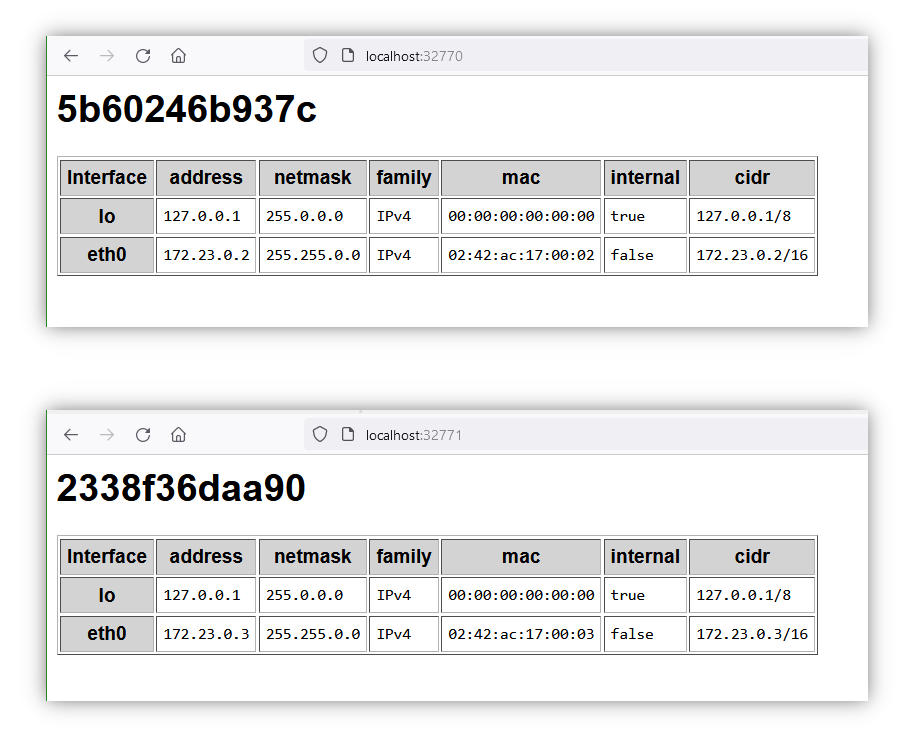

# show-interfaces

This GIT repository shows:
* How to retrieve network interface information with node.js.
* How to build a simple web server with node.js.
* How networks are created by Docker.

After cloning this repo you have several possibilities to run it. These are described in the following chapters.

## Start your local web server

Execute the following commands on the command line when this folder is your current working folder:

`npm install`
`node showInterfaces.js &`

The second line starts the web server as a background process.
There should be a message shown "Server running on port 3000".
Then you can start your favorite browser and try this URL: http://localhost:3000/
This site should show your host name as title.
Below you should see a list of the network interfaces available on this machine together with additional information.
You can stop the web server by the command `kill -9 <pid>` where <pid> is the process id reported on startup.

## Create your local docker image and run two containers based on it
If you have a local installation of docker and docker compose, you can execute this command:
`docker compose up -d`
This command start builds a docker image according to the definitions given by the file 'Dockerfile'.
Then a two containers are created based on this image and both are started.
The command `docker ps` should show both running containers together with port mappings similar to the following:

    0.0.0.0:32770->3000/tcp, :::32770->3000/tcp
    0.0.0.0:32771->3000/tcp, :::32771->3000/tcp

This means that you now should be able to access both, http://localhost:32770/ and also http://localhost:32771/ 
Both pages should show the available networks.
The local ip addresses of the two web servers should be different, but belonging to the same subnet.

Here is an example of what the two web servers can show:

You stop the two containers and remove them by the command `docker compose down`.

## Run the container uploaded to GitHub
...

